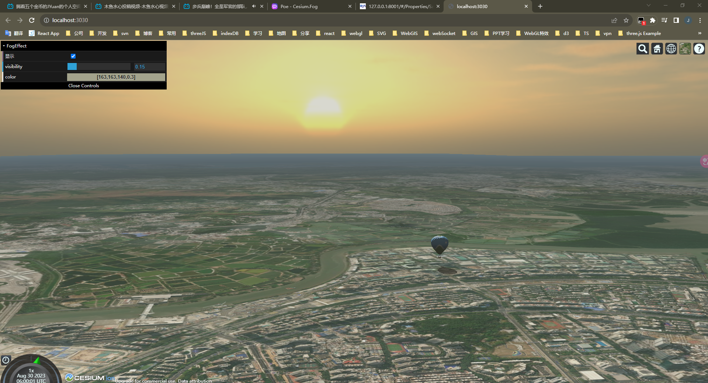
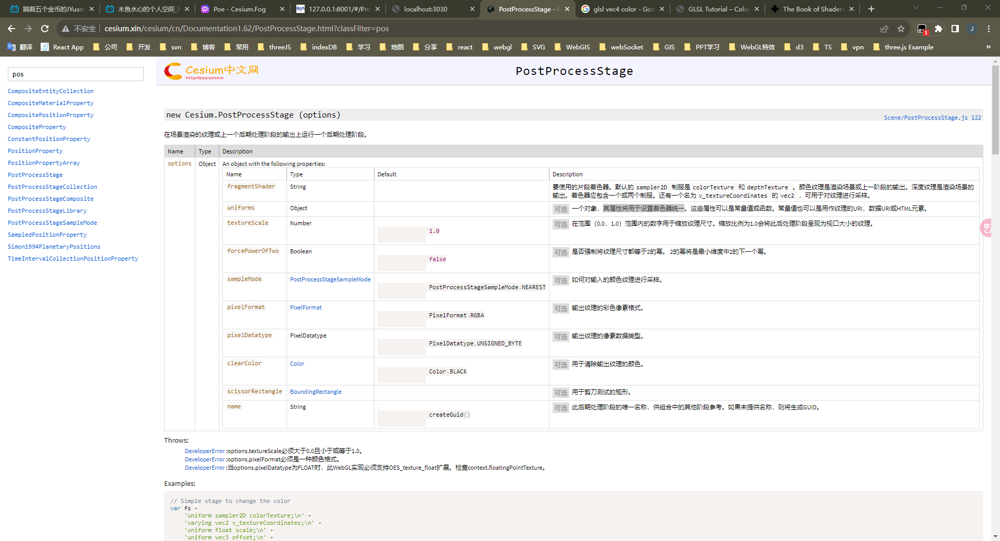

# 起雾了？如何给 Cesium.js 世界添加一场大雾（Cesium.js 天气效果开发）

> 我之前有使用过 Cesium 的`Cesium.Fog`的雾化 API，虽然它某些方面很强大，但是它的效果和操作让我很不适应（最让我不理解的是，这个`Cesium.Fog`颜色和透明度都不能修改）。
>
> 于是乎，我整理开发了 FogEffect 类，并展示这个 Dome。
>
> - [查看地址](https://cesium-fog-effect.vercel.app/)
> - [仓库地址](https://github.com/WaterSeeding/CesiumFogEffect)

 

## 效果

如图所示，远方的太阳从地平线上升，这一刻光芒万丈，热气球刚离开地面，就在城市街道上映照自己轮廓的影子，但此刻还是清晨时分，雾气还是没有消散，弥漫朦胧在整个空间，Cesium.js 世界苏醒了~~

 

## 思路

> 这里是使用到`Cesium.PostProcessStage`，来自定义一个雾气后期处理阶段。

### Cesium.PostProcessStage 用法

1. fragmentShader

要使用的片段着色器，默认的 sampler2D 制服是 colorTexture 和 depthTexture 。颜色纹理作为渲染场景或上一阶段的输出。

该着色器应包含一个或两个 uniforms。还有一个名为 v_textureCoordinates 的 vec2 ，可用于对纹理 UV 进行采样。

2. uniforms

作为设置片段着色器的uniforms。

 

### 开发历程

 

## 相关资料

- [Cesium](https://cesium.com/)
- [Cesium Documentation](https://cesium.com/docs/)
