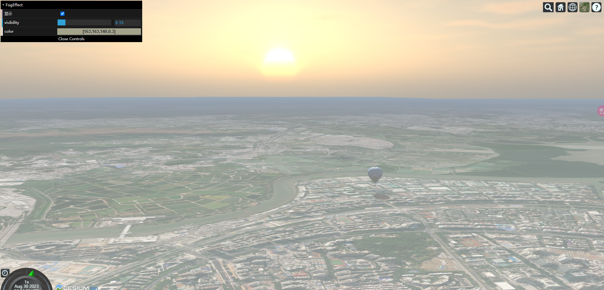
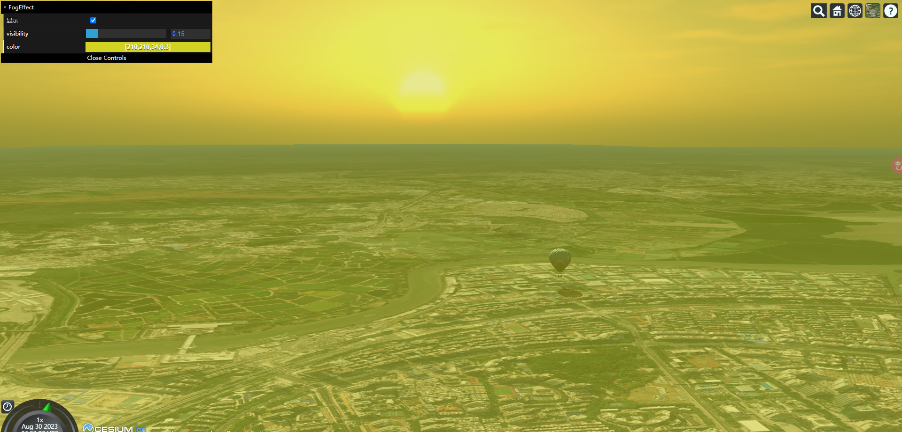
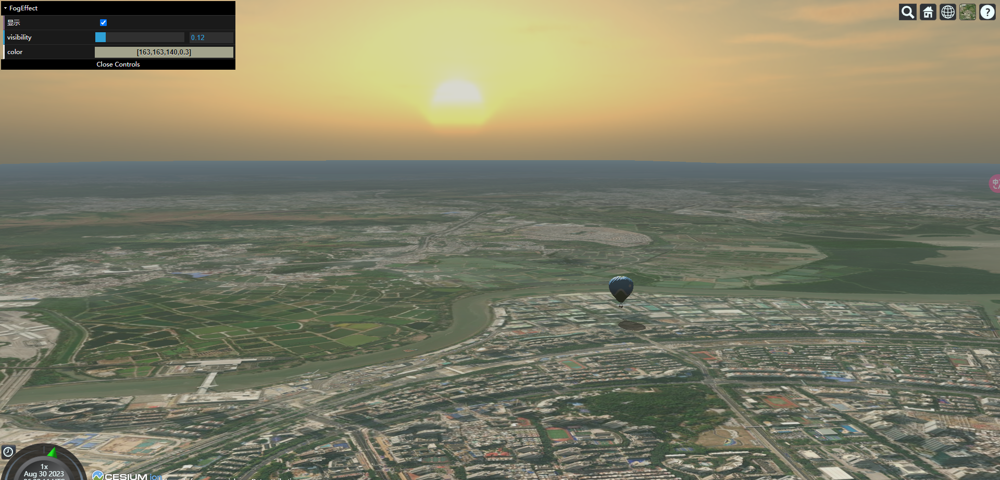
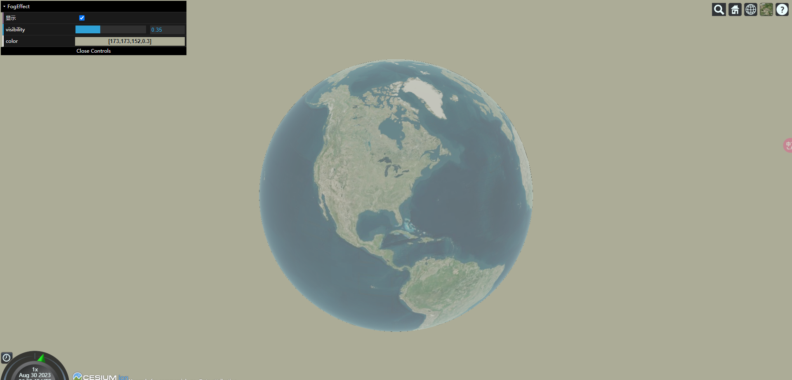

# 起雾了？如何给 Cesium.js 世界添加一场美美的大雾（Cesium.js 天气效果开发）

> 我之前有使用过 Cesium 的`Cesium.Fog`的雾化 API，虽然它某些方面很强大，但是它的效果和操作让我很不适应（最让我不理解的是，这个`Cesium.Fog`颜色和透明度都不能修改）。
>
> 于是乎，我整理开发了 FogEffect 类，并展示这个 Dome。
>
> - [查看地址](https://cesium-fog-effect.vercel.app/)
> - [仓库地址](https://github.com/WaterSeeding/CesiumFogEffect)

<br />

## 效果


如图所示，远方的太阳从地平线上升，这一刻光芒万丈，热气球刚离开地面，就在城市街道上映照自己轮廓的影子，但此刻还是清晨时分，雾气还是没有消散，弥漫朦胧在整个空间，Cesium.js 世界苏醒了~~

<br />

## 思路

> 在此需要使用到`Cesium.PostProcessStage`，来自定义一个雾气后期处理阶段。

### Cesium.PostProcessStage 用法

1. fragmentShader

要使用的片段着色器，默认的 sampler2D 制服是 colorTexture 和 depthTexture 。颜色纹理作为渲染场景或上一阶段的输出。

该着色器应包含一个或两个 uniforms。还有一个名为 v_textureCoordinates 的 vec2 ，可用于对纹理 UV 进行采样。

2. uniforms

作为设置片段着色器的 uniforms。


<br />

### 开发历程

1. 自定义 PostProcessStage 雾化处理阶段：



```ts
let fogStage = new Cesium.PostProcessStage({
  name: "Cesium_FogEffect",
  fragmentShader: FogEffectSource,
});
viewer.scene.postProcessStages.add(fogStage);
```

```ts
uniform sampler2D colorTexture;
in vec2 v_textureCoordinates;
out vec4 fragColor;

void main(void) {
  vec4 origcolor = texture(colorTexture, v_textureCoordinates);
  vec4 color = vec4(1.0, 1.0, 1.0, 1.0);
  fragColor = mix(origcolor, color, 0.5);
}
```

> colorTexture 是一个纹理对象，它存储了颜色信息。
> depthTexture 是一个纹理对象，它存储了深度信息
> texture()是一个 GLSL 函数，用于从纹理中获取特定纹理坐标处的颜色值。
> mix()是一个用于混合两个颜色值的函数。

- 通过顶点的纹理坐标`v_textureCoordinates`，从`colorTexture`纹理中获取对应位置的颜色值，将结果存储在 origcolor 变量。
- 然后，将 origcolor 和 color 两种颜色值按照 0.5 的比例进行混合，然后将混合结果存储在 fragColor 中。（混合操作将根据混合因子在两种颜色之间进行线性插值，产生一个介于两种颜色之间的新颜色。）
- 最后程序会自动将 fragColor，输出到对应顶点位置的纹理上。

<br />

2. 添加颜色控制：



```ts
let fogStage = new Cesium.PostProcessStage({
  name: "Cesium_FogEffect",
  fragmentShader: FogEffectSource,
  uniforms: {
    color: color,
  },
});
viewer.scene.postProcessStages.add(fogStage);

const setColor = (colorV: number[]) => {
  let color = new Cesium.Color(
    colorV[0] / 255,
    colorV[1] / 255,
    colorV[2] / 255,
    colorV[3],
  );
  fogStage!.uniforms.color = color;
}
```

```ts
uniform sampler2D colorTexture;
uniform float visibility;
uniform vec4 color;
in vec2 v_textureCoordinates;
out vec4 fragColor;
void main(void) {
  vec4 origcolor = texture(colorTexture, v_textureCoordinates);
  fragColor = mix(origcolor, color, 0.5);
}
```

- 通过uniform变量将color传入片元着色器中
- 后期通过`setColor`函数来修改`uniforms.color`，达到场景雾化颜色的变化

<br />

3. 添加强度控制：



```ts
uniform sampler2D colorTexture;
uniform sampler2D depthTexture;
uniform float visibility;
uniform vec4 color;
in vec2 v_textureCoordinates; 
out vec4 fragColor;
void main(void) { 
  vec4 origcolor = texture(colorTexture, v_textureCoordinates); 
  float depth = czm_readDepth(depthTexture, v_textureCoordinates); 
  float f = visibility * (depth - 0.3) / 0.2; 
  if (f < 0.0) f = 0.0; 
  else if (f > 1.0) f = 1.0; 
  fragColor = mix(origcolor, color, f); 
}
```

```ts
let fogStage = new Cesium.PostProcessStage({
  name: "Cesium_FogEffect",
  fragmentShader: FogEffectSource,
  uniforms: {
    visibility: visibility,
    color: color,
  },
});
viewer.scene.postProcessStages.add(fogStage);

this.fogStage!.uniforms.visibility = values;
```

> czm_readDepth()是Cesium提供的函数，用于从深度纹理中读取特定纹理坐标处的深度值。

完整的步骤来一次

- 通过顶点的纹理坐标`v_textureCoordinates`，从`colorTexture`纹理中获取对应位置的颜色值，将结果存储在 origcolor 变量。
- 通过顶点的纹理坐标`v_textureCoordinates`，从`depthTexture`深度纹理中获取对应位置的深度值，并将结果存储在depth变量中。
- 然后设定相应的算法，计算出f混合因子。
- 然后，将 origcolor 和 color 两种颜色值按照 f混合因子 的比例进行混合，然后将混合结果存储在 fragColor 中。（混合操作将根据混合因子在两种颜色之间进行线性插值，产生一个介于两种颜色之间的新颜色。）
- 最后程序会自动将 fragColor，输出到对应顶点位置的纹理上。

<br />

## 不足



因为这个雾化只是简单的PostProcessStage后期处理，并没有考虑实际的地理概念，于是会出现当镜头脱离地球，从太空俯视时，仍然有雾化的效果。
如果，有大佬知道如何处理，请告诉我下，教教我如何进一步优化！

<br />

## 总结

虽然这个雾化看来来很简陋，但是能进一步让Cesium的世界美美的，也是开发的有价值了~~

<br />

## 相关资料

- [Cesium](https://cesium.com/)
- [Cesium Documentation](https://cesium.com/docs/)
